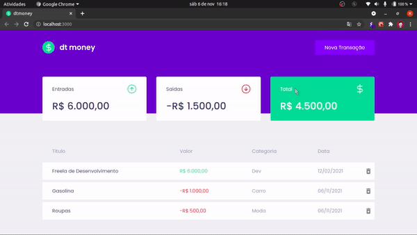

# DtMoney - Projeto - Trilha React

- Projeto desenvolvido durante o treinamento Ignite da Rocketseat
- O projeto conta com uma API mock criado mo mirageJs
- Para que a API mock seja ativada altere o arquivo .env.example para .env e mude o valor de REACT_APP_FAKE_SERVER para 'false'



# Executar

- Requisito: NodeJs

```bash
# Depois de clonar o projeto, navegue até a pasta raiz e instale as dependências com o seguinte comando...
yarn install
# ou
npm i

# Agora inicie a aplicação
yarn dev
# ou
npm run dev
```
